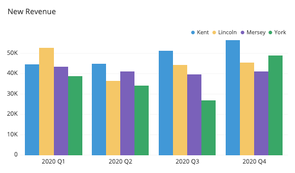

<link rel="stylesheet" href="reveal_custom.css">

<!--

<!-- 2. Create hidden header/footer 
 -->

<!--

    

        
HEADER-LEFT

        

        
FOOTER-LEFT

    

 

 -->

<section>

Optimising community service use with ePRO-based screening during routine Radiation Oncology care

A <a href="https://www.nslhd.health.nsw.gov.au/RadiationOncology/Pages/default.aspx">Northern Sydney Cancer Centre</a> and <a href="https://www.canteen.org.au/">Canteen</a> Collaboration 
Presented at <a href="https://www.sydney.edu.au/cancer-research-network/sydney-cancer-conference-2021.html">Sydney Cancer Conference 2021</a>

Dr Thilo Schuler, Ms Claire King, A/Prof Michael Back, Ms Tamara Doria, Ms Paula Macleod, A/Prof Pandora Patterson, Prof Thomas Eade

</section>
---



### Background

Community services in cancer care are:

👠important, but 
😞 underutilised  

<!--

<ul>  
<li class="fragment pointy">TODO: Underutil REF (screenshot of article title) </li>  
<li class="fragment pointy">TODO Low RNSH/NSLHD referral rates vs potential referees (?pie charts) </li>  
</ul>  

-->

Reasons include:

⏱️ Time constraints of clinical reality 
📉 Quickly waning effect of traditional referrer info campaigns 
🤷 Insufficient knowledge → no/unconvincing recommendation to patient 

---



### Aim & Methods

Systematic and sustainable referral to Quitline and Canteen using an Implementation Science approach:  

- Screening via routine **electronic patient-reported outcomes (ePRO) survey** for all new patients
- Added two extra questions regarding **smoking status** and **age of children**
- **Co-designed** information and referral approach
- Key role: **Patient Care Radiation Therapist (PCRT)** providing emotinal support incl service referral offer
- **Evaluation**: Pre/Post analysis of referral rates and clinical staff survey

<!---->

Image Credit: [WHO](https://www.who.int/tdr/capacity/strengthening/ir-training/en/)

---


          
### Results

**6 months ePRO screening** 📱
- Aug 2020 - Jan 2021
- 366 patients 
- 88% response rate  

**Quitline referral** 🚭
- 24 (6.6%) smokers
- 9 (38%) accepted referral
- **Over 100% increase** vs whole NSLHD rates in 2018

**Canteen referral** 👦🏽👧🏻
- 85 (23%) of cancer patients had children aged 0-25yrs
- 18 (21% of eligible) accepted referral
- Annualised **350% increase** vs 2018.

**Clinical staff survey** 👂
- Response rate 34 of 77 (44%)
- 100% → overall patient benefit
- 97% →  emotional and/or professional comfort for clinicians

---



### Conclusion & Future

Successful routine care translation 💪 with benefits for patients 🤒 and clinicians ⚕️  
- Systematic ePRO-based screening
- Co-design strategy including PCRT training
- Plans to apply this model more broadly (other services incl internal pathways)

##### Patients ↔ Services = ❤️

<!-- 
 -->
