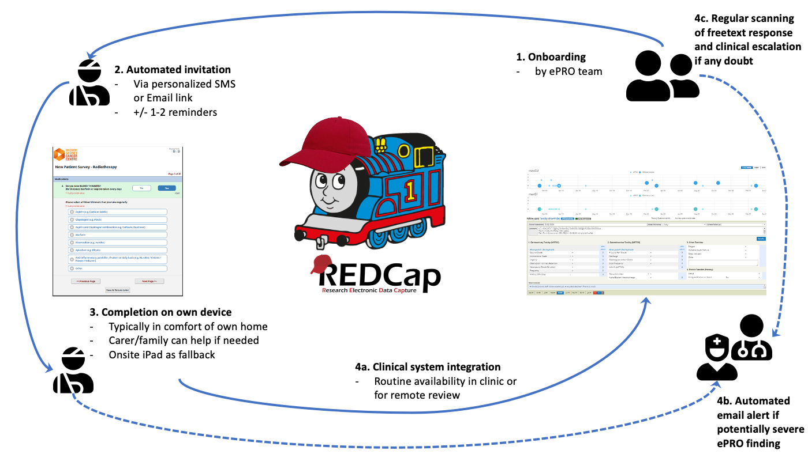

class: middle
background-image: url("img/RANZCR_Presentation_ASM_2021_BG.png")
background-size: cover
<br>
# .white-col[Driving innovation through electronic PROMs in Radiation Oncology routine care]

### [RANZCR ASM 2021](https://www.ranzcr2021.com/)

### .white-col[**Thilo Schuler**<sup>1,2</sup>, Andrew Kneebone<sup>1,3</sup>, George Hruby<sup>1,3</sup>, Rebecca van Gelder<sup>1</sup>, Julia Hunter<sup>1</sup>, Blanca Gallego<sup>2,4</sup>, Thomas Eade<sup>1,3</sup>] 

### .white-col[1.] [NSCC](https://www.nslhd.health.nsw.gov.au/RadiationOncology/Pages/default.aspx), .white-col[2.] [AIHI](https://www.mq.edu.au/research/research-centres-groups-and-facilities/healthy-people/centres/australian-institute-of-health-innovation/aihi-research-centres/health-informatics), .white-col[3.] [USyd](https://www.sydney.edu.au/medicine-health/schools/clinical-schools/northern-clinical-school.html), .white-col[4.] [CBDRH](https://cbdrh.med.unsw.edu.au/)

---
layout: true

background-image: url("img/Precise_NSCC_logo_353_100.jpg")
background-size: 200px
background-position: 96% 4%

---
# Patient-reported Outcome Measures
<br>
> ###Patient-reported outcome measures capture a person’s perception of their own health through questionnaires (ACSQHC).

<center>
```{r title, out.height="300", out.width='90%', fig.align='center'}
library(DiagrammeR)
DiagrammeR::grViz("

digraph {

  # a 'graph' statement
  graph [layout = dot, rankdir = LR, overlap = false]

  # several 'node' statements
  node [shape = square,
        fontname = 'Century Gothic',
        style = filled,
        color = white,
        fontcolor = white,
        fontsize = 35,
        fixedsize = true,
        width = 3
        ]
  ranksep=5;      
  node [fillcolor = steelblue]
  
  node [label =
'Research tool']
  reprex1
  
  node [label =
'Research 
intervention 
(ePRO)']
  reprex2
  
  node [fillcolor = coral,
        label =
'Routine
care
translation']
  reprex3
  
  edge [color = grey, penwidth = 5, arrowsize=2]
  reprex1 -> reprex2 
  reprex2 -> reprex3 [style=dashed]

}
")
```
</center>

---
# ePRO(M)s
.pull-left[
### ePRO Benefits
* Better QoL (symptom control)
* Better communication
* Survival benefit (Basch et al, JCO 2016)
]

.pull-right[
### ePRO  Challenges  
* Complex healthcare workflows
* Culture & Clinician By-in
* Technology (Integration)
]  
<br>
.pull-left[
### ePRO Opportunities
* A successful ePRO implmenentation enables innovative routine care approaches...
]

---
background-image: url('img/slide4.png')
background-size: cover
class: left, top

---
background-image: url('img/full_team.png')
background-size: cover
class: left, top

# Clinical GU ePRO team @ NSCC

---
background-image: url("img/Precise_NSCC_logo_353_100.jpg"), url("img/ir_toolkit_identity_300_who.png")
background-size: 200px, 300px
background-position: 96% 4%, 80% 60%

# Journey

.pull-left[
### 2016
* **Onsite ePRO** collection (iPad in waiting room) 
* Completion rates (35-59%; ASM 2017) too low.

### 2017
* **Offsite ePRO**: No commercial vendor
* Re-Discovery of **REDCap** as "ePRO survey engine" (survey designer & API)

### 2018
* Re-implementation of in-house clinical research system enabling REDCap **Integration**   
]


---
background-image: url('img/ProDB_ePRO.PNG')
background-size: cover
class: left, top

---
background-image: url('img/REDCap_Pt.PNG')
background-size: contain
background-position: 50% 0%

---
# REDCap as ePRO Survey Engine
<center></center>

---
background-image: url("img/Precise_NSCC_logo_353_100.jpg"), url("img/requite_black.png")
background-size: 200px, 300px
background-position: 96% 4%, 50% 70%
# Surveys and Frequencies in our GU Practice
<br>
#### Superset of international [REQUITE](https://requite.eu/) consortium's questionnaire:
* **Baseline** (ePRO prior to new patient appointment)
* **Peri-treatment** (abridged; weekly ePRO during and in first month post RT)
* **Follow-up** (6 monthly ePRO)
---
background-image: url("img/Precise_NSCC_logo_353_100.jpg"), url("img/completion_plot2.png")
background-size: 200px, 900px
background-position: 96% 4%, 50% 90%

# ePRO Coverage & Completion
Between Jan 2019 - June 2021 (30mo) n=3201 invitations (+/- reminders) for separate ePROs were sent as part of NSCC prostate cancer clinic. 
```{r}
library(tibble)
library(kableExtra)
completion_output <- tibble("row" = c("Coverage (only for 2019)","Completion (Jan 2019 - Jun 2021)"),
       "Baseline" = c("85%", "94% (293/311)"),
       "Peri-treatment"= c("-","91% (1170/1292)"),
       "Follow-up" = c("-", "76% (1216/1598)")) %>%
  column_to_rownames(var="row")
completion_output %>%
  kbl() %>%
  kable_styling()

```
---
background-image: url("img/Precise_NSCC_logo_353_100.jpg"), url("img/duration_plot2.png")
background-size: 200px, 900px
background-position: 96% 4%, 50% 90%

# ePRO Duration
```{r}
library(tibble)
duration_output <- tibble("row" = c("1st Quartile","Median", "3rd Quartile"), 
                            "Baseline" = c("6.0 min", "8.2 min", "12.7 min"), 
                            "Peri-treatment"= c("1.8 min","3.0 min", "5.1 min"),
                            "Follow-up" = c("7.7 min", "11.1 min", "16.1 min")) %>%
  column_to_rownames(var="row")

#install.packages("kableExtra")
library(kableExtra)
duration_output %>%
  kbl(align = "lcl") %>%
  kable_styling()
```

---
# ePRO Innovations

#### Toxicity monitoring over time 
  * Longitudinal (late) toxicity monitoring ➡️ more relieable including less interrater issues with **ePROs**.
  * Trend for hypo#/SBRT with acute symptom peaks post RT course ➡️ remote **ePROs** +/- alerts can capture them and trigger actions.  
  
#### Safe, risk-adapted remote follow-up

* Even before COVID-19 we had started to integrate **ePROs** into our phone follow-up program 
* We are working on an **ePRO**-only approach under certain circumstances

#### Embedded, pragmatic real-world clinical trials

* Our ongoing in-house prostate cancer RCT (def. hypo# vs SBRT) has recruited n=188 pts in 2 years 
* Without **ePROs** this wouldn't have been possible in a small 3 linac department.

#### Innovative care pathways 
* Recent presentation on **ePRO**-driven referral pathway to community services
* Slides and **video** here: [https://thiloschuler.me/project/epro-driven-crisp](https://thiloschuler.me/project/epro-driven-crisp)

---
background-image: url("img/Precise_NSCC_logo_353_100.jpg"), url("img/qr_dashboard.png"), url("img/qr_crisp.png")
background-size: 200px, 200px, 200px
background-position: 96% 4%, 23% 90%, 77% 90%

class: center, middle 

# Conclusion 

### Routine care ePROs are .highlight[challenging on multiple levels], but definitely .highlight[feasible] and well worth the effort as they open .highlight[exciting opportunities] to improve the care for our patients. 

.pull-left[
#### Link to **ePRO Dashboard**: [https://thiloschuler.shinyapps.io/prospector-asm21](https://thiloschuler.shinyapps.io/prospector-asm21/) 
]

.pull-right[
#### Link to ePRO-driven referral process incl **video**): [https://thiloschuler.me/project/epro-driven-crisp](https://thiloschuler.me/project/epro-driven-crisp)
]
<br>
## Thank you <br> 🙏
